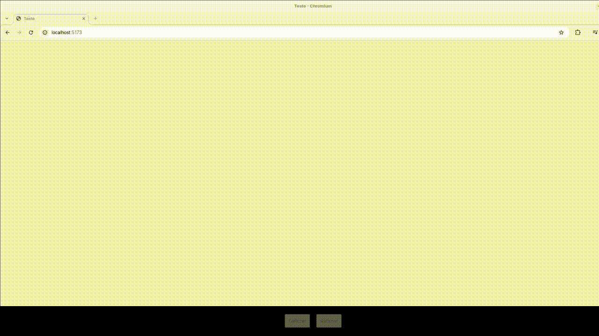

# Teste Técnico - Front End - Júnior

## Descrição:
Desenvolva uma aplicação web utilizando React com Vite.

## Objetivos:
1° Ao clicar na tela, um círculo deve ser inserido exatamente na posição do clique.

2° Implemente um botão "Desfazer" que remova o círculo adicionado.

3° Crie também um botão "Refazer" que reinsira o círculo removido.

4° Caso o usuário utilize a função de desfazer e, em seguida, clique para adicionar um novo círculo, os círculos já existentes devem ser mantidos e os que estavam desfeitos devem ser descartados.

## Referência:
https://www.youtube.com/watch?v=dOsBtM2U018&t